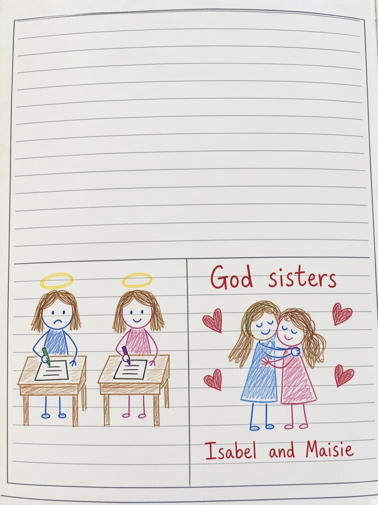
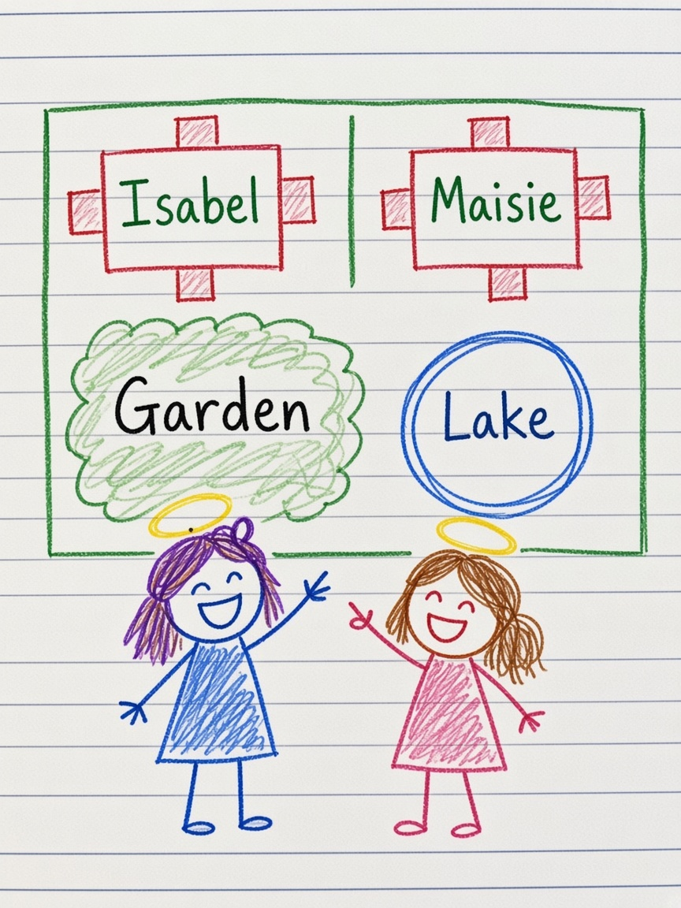

# God Sisters

*From Isabel’s letters to Maisie. Illustrated from her drawings.*

## Chapter 1 — A sunny day

Good morning.

That was how Maisie liked to start a letter, even if the paper already had Monday through Sunday printed at the top and the date line was still empty. She wrote **From God sister: Maisie** and then the day itself, because the day mattered. Today was a sunny day.

Isabel was her god sister and her bestie. They had a third person in the diagram too: Luna, Isabel’s baby sister, two years old, sitting in the middle of their power like a little star. You. Me. Our power. Luna.

Sometimes the letters were about school. A teacher said one thing. Mr. Lun said another. Maisie did not know if she should tell, or help, or stay quiet. Isabel wrote in the margin, *What are we going to Do?* and then, stubborn as a song, *If you do, I will do. If you don’t do, I will not do.*

That was how they were. Not only friends. Sisters. Besties. Family.

## Chapter 2 — Songs on the lines

When talking felt too small, they sang.

Together together, they were going to the park. If they didn’t go to the park, they could not be together, so they wanted to be together, and they were always together. Isabel wished to be a little sister because she had a big-sister feeling in her chest and she loved it. Friends were two. Friends were four. They could make the song together, like Maisie and Isabel.

God sister was not only friends. Live together. Grow together. They will never died forever.

Isabel song said they were the best in the world. In the sea, the sea was beautiful, beautiful, beautiful. Even letters had a song. EEEE did not need A. Four E’s made a class.

Maisie wrote *I am Maisie, I am Isabel,* and then *bleu…… Not bleu? What is bleu?* and then the true part: *I love to play with you not only sisters.*

## Chapter 3 — Missing days

One week Isabel was not at school.

Maisie wrote as if the page could run down the hallway. Sister, why are you not at school for two days? I miss you. Are you sick? No one plays with me. Only Toby. I want to play with you. PLAY.

In her dreams she still saw them at school. She remembered Isabel looking sick there too.

Isabel wrote back. I’m sorry. Yeah, I’m sick. But now I’m here. We can play. I stayed for SIX days: Friday, Saturday, Sunday, Monday, Tuesday, Wednesday. Even the medicine is sweet. I ate candy. I drank boba tea. I had french fries. Here’s an emoji.

Maisie was already thinking about later. They had only been god sisters a little time. In the 41 days she would soooo miss Isabel. When she looked at the pen Isabel gave her, she would remember. She would take it everywhere, even to 四川. On the last day at school she would write a 信, a letter only for them, not for anyone else.

## Chapter 4 — A house and a shop

Isabel drew a house as if wishing could be a floor plan.

Kitchen. Bookshelf. Maisie’s bedroom. Isabel’s bedroom. Living room. Second living room. Sofa. Garden. Lake. Front entrance. Bird house.

Please? Please? Okay.

Maybe they could be English tutors. Maybe they could work together in a shop WE opened. Please!!!

Isabel’s spelling notes were gentle and teasing. Maisie wrote “a boat” when she meant “about.” “Bestie” turned into “baftie.” Isabel said it was starting to get important to learn real grammar. She signed it *besties, Godsisters.*

School still got in the way. Harvey cut in and led Maisie away, and Isabel felt betrayed because then she could not talk. Maisie was sad when someone would not let her play a game. Max was more good at the game. She wanted to cry. She wanted summer holiday in 深圳 together.

## Chapter 5 — After the contest

Isabel asked, Do you think I can win Lennon next year? I think so.

She always said, if you know how to spell “principal,” you know how to spell other things. Then she forgot, and remembered after the competition, and she lost. First time to lose. Furious, sad, and encouraged. She did not even think she was right. She felt wrong. It was a big deal.

She decided to let the sadness go.

Don’t write so many letters until then, she said. That’s why I said bye. We can’t talk now. Save your strength for later.

God sisters,
Isabel.

On another page Maisie only wrote, You are so good. Good. Good. Good.

The notebook still had empty date lines. The songs were still on the page. The house was still drawn, two bedrooms, a lake, a garden, waiting.
