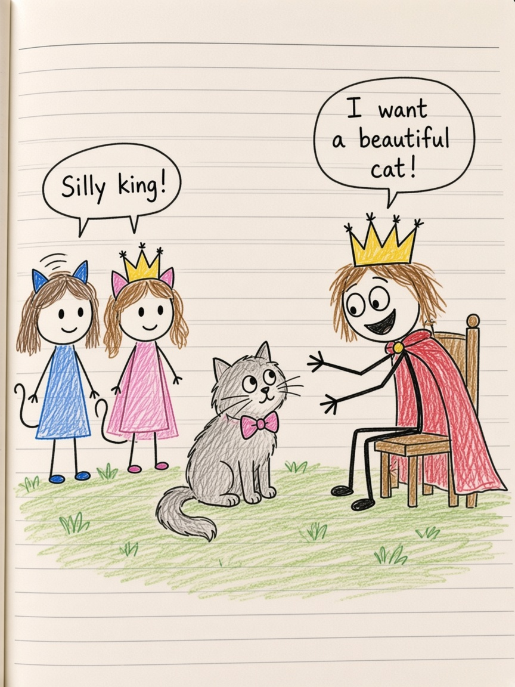

# The Cat Kingdom

*From Isabel’s comic: Ivi is a cat, cat Isabel, and King Mr R.*

## Chapter 1 — Yes she is a CAT

Ivi stood on the lined paper as if the lines were grass.

“Ivi is a cat too?” someone asked.

The answer was not shy. It was huge. **Yes! she is a CAT!**

Once you knew that, you started seeing ears on everyone. Cat Maisie with a cape. Cat Isabel with a cape. Ordinary girls in the margin, and then — pop — tails. Ivi could always run to cat now. It was not a trick. It was a door she already knew how to open.

They asked each other the useful questions. What can we help you? Please. This is to do. The kingdom of cats was not a castle so much as a feeling: we are together, we can help together.

## Chapter 2 — Mr R

King Mr R wanted to had their cat.

He was the king of the PeoP, which is a serious job if you are a king drawn in a hurry. He thought cat Isabel was more beautiful and big. So they take one of our cat first, the page said. They wanted the kingdom too. They wanted the other cats. They knew that if I am not there with them, they can take all of the cats.

Cat Isabel was not only pretty. She was the kind of cat a king notices. That is a dangerous kind of pretty.

“We need help,” said a small voice, which is how kingdoms get saved.

Ivi’s name showed up in a bubble like a spark. What happe. Next.

## Chapter 3 — The ciandom at night

Help arrived the way help arrives in Isabel’s notebook: friends showing up on the same line.

You will not die, because you are with us. We can help together.

They went to the ciandom, which might have been a kingdom spelled the way a tired hand spells it at the end of a page. At night the cats slept in a pile. Zzz. Who are they? Maisie. Isabel. Together. Playing. Sleeping.

King Mr R could want a beautiful cat. He could want a kingdom. He could not have the pile.

In the morning they would still be cats if they wanted. Ivi would still be a cat too. The lined paper would still hold them.

The End.

Not a sad end. A sleeping end. The best kind, if you are a cat.
