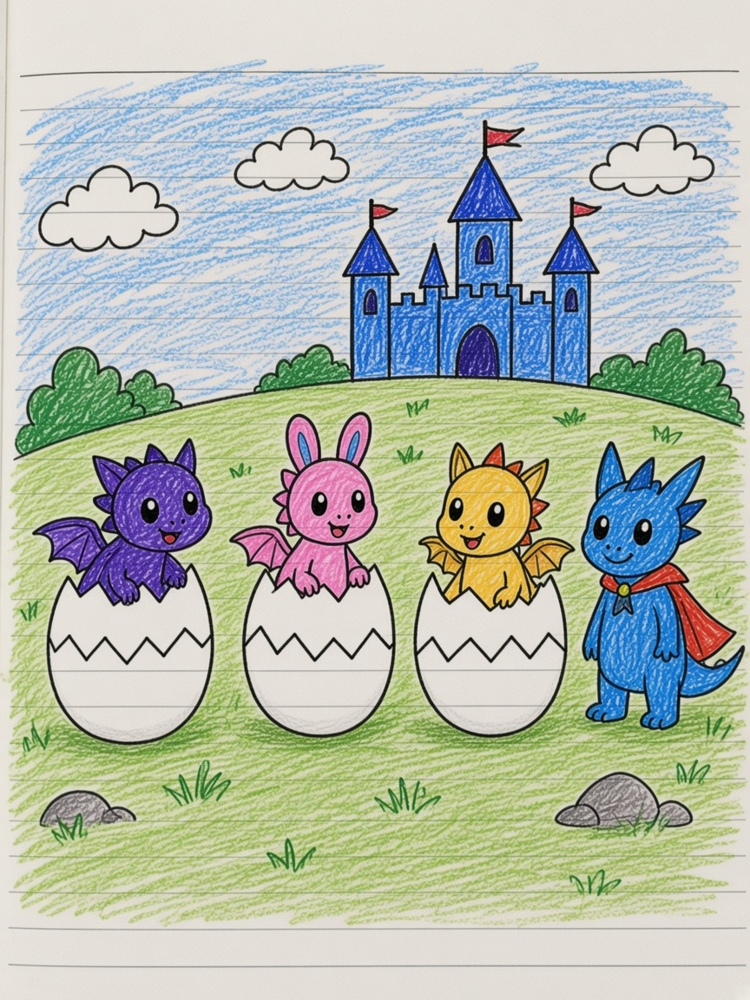

# Hum Dragon Ville

*From Isabel’s colored comic: hatching day, years later, PICNIC, portal home.*

## Chapter 1 — On the day they were born

On the day they were born, the hill already had a castle, which is the correct way to be born if you are a dragon.

Eggs sat in the grass. One cracked. Then another. A small creature stepped out into weather for the first time. There was a purple one like a fox who had decided to be a dragon. There was a pink one like a bunny who had decided the same. There was a yellow one with little wings. There was a blue one with a cape, and someone had the idea of 公主, princess, sitting on her like a name.

While they were just hatched, the undercover princess was fighting for her life. Or was she? Let’s find out.

Isabel wrote it that way, with a question, because a princess who is also a dragon egg is allowed to keep a secret.

## Chapter 2 — Years later

Years later they were still a crew.

They held hands in a row on the same hill. The castle was smaller because they were bigger. They could talk now, which is dangerous.

“I’m the fastest dragon of all time!”

“Finally here.”

“She’s faster than the lightning!”

“Yep!”

Speed was a kind of love. So were magic spells. What else can you do? Wow. Wait like what.

One of them could move things with her mind. A kettle lifted. A picnic blanket knew where to go. Someone created portals to a socket space. I created this magic to be the entrance door of my home. No theft.

That last rule was important. A home with a rainbow door still needs a lock made of manners.

## Chapter 3 — PICNIC

The word took a whole panel.

**PICNIC!**

Checkered blanket. Snacks. The yellow dragon. The pink bunny. The purple fox-dragon. Steam from a cup. The sky still had room for them.

They were not fighting the way the undercover princess had fought on hatching day. They were doing the other dragon job: staying. Eating. Boasting. Opening a door that only friends could use.

If you stood on the hill at the right hour, you would see four small shadows and one rectangle of rainbow, and you would not steal anything, because the sign said so, and because they would notice. They were the fastest. They were also the hungriest. That is a strong combination.
