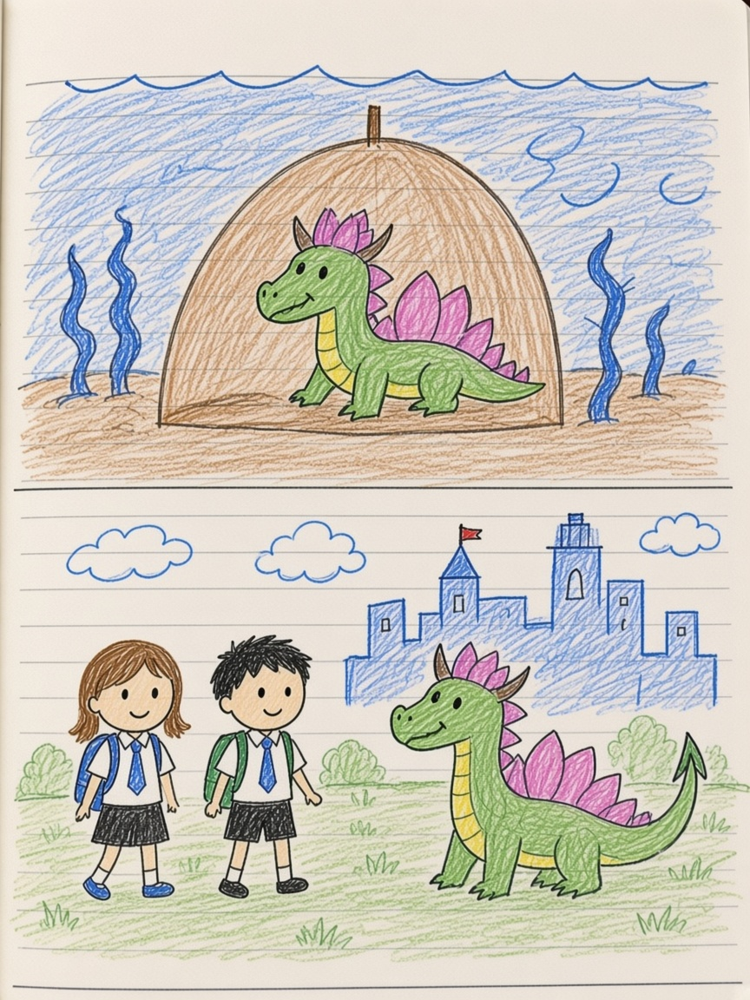

# Water City

*From Isabel’s Chinese comic: 荷花龍, 水城, undersea home, students, To Be Continued.*

## Chapter 1 — The lotus dragon

Someone pointed at a small dragon near a flower and said the important sentence:

你是神話中的荷花龍.

You are the lotus dragon from the stories.

Once a creature is named like that, the water around it gets deeper. Isabel had already drawn 龍城, dragon city, with tiny flying dragons and a friend on a lily pad shouting *help! friends!* This water was different. This water had a city in it.

## Chapter 2 — I don’t welcome you

They were small once, the page said, and they could already do something because a big brother was the center. 山山 was the little dragon on the left.

Then a fight. 死吧. Why? Because I don’t welcome you to 水城.

Water City had a gate made of that sentence. Not every dragon was invited. A horned figure stood with a spear. Another asked, are you my boss’s sister? You are not… are you?

The water did not care about manners. The water cared who belonged.

## Chapter 3 — Home under the sea

到了海底的家.

They arrived at the undersea home. A tent. A sister. Someone had forgotten himself. Dark colors were no use. It was time to get up. 加油. Put on clothes. A shining entrance. Disguise yourself. Go to the human city. Become middle school students.

That is a long list for one page, but Isabel’s stories move like that: tent, clothes, school uniform, done. The lotus dragon could sit in a myth. The children needed backpacks.

In 人城 they would look like everyone else. That was the point of the disguise. The point of the home under the sea was the opposite: you could still be what you were.

## Chapter 4 — Thank you for saving me

A small creature with ears said the last true thing.

姐姐，谢谢你们来救我.

Sisters, thank you for coming to save me.

Then the lined paper did what lined paper does when a story is bigger than the notebook:

**To Be Continued**

Water City is still there. The lotus dragon is still mythical. The students are still walking to class with secrets in their shoes. The next page is waiting for Isabel’s hand.
