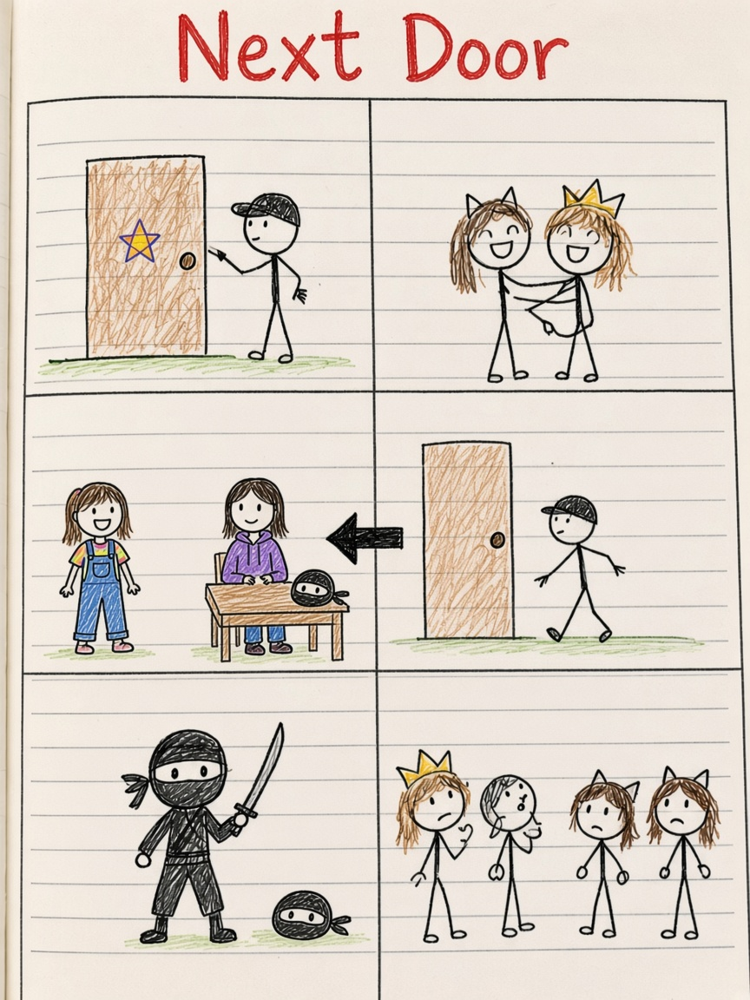

# Next Door

*From Isabel’s comic: next door, 2018, 2026, masks, ninja, who are you?*

## Chapter 1 — She remembers me

The first door was ordinary. A rectangle. A knob. The words **next door**.

A character pointed as if pointing could open wood. Next door. Next door again. Someone leaned out of a window of time and said, me! she remembers me!

Being remembered is a plot. It means you existed in two places: then, and in someone else’s head now.

## Chapter 2 — Nine and eighteen

Out!

The crowd on one side of the page was labeled 2026. I am eighteen old. But she moved on. That was when she was nine years old.

On the other side: I am nine years old. 2018.

The same person, split by a black arrow and eight years. The nine-year-old still had to explain. The eighteen-year-old had already gone out the door and come back to a house that did not keep her in the same room.

I’ll just go, said someone at a door, which is what you say when the math of years is too loud.

I can explain.

Who are you?

## Chapter 3 — Take off the mask

She is a ninja. I know!

Who are you?

Take of the mask.

Moonie who knows me.

Who are you?

The questions stacked. Masks are useful if you are a ninja next door. Masks are a problem if the whole story is about being remembered. You cannot be remembered by a face you will not show.

Isabel drew them in a row at the bottom, friends and almost-friends, tails and stars and questions. The door kept appearing. Out. Next door. Out.

2018 did not vanish because 2026 arrived. Both years stayed on the page, which is the kindest thing a comic can do for a person who changed. You can still see the nine-year-old. You can still see the eighteen-year-old. You can still knock.

Who are you?

The notebook does not answer. It only keeps the door.
