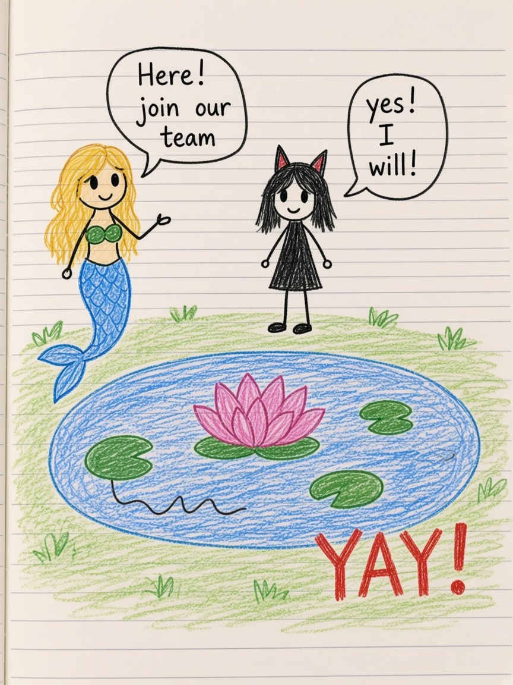

# The Pond Team

*From Isabel’s pond page, the mermaid “join our team,” and the last messy ending.*

## Chapter 1 — A full size pond

Someone wrote it with a star, as if the pond had been waiting for a proper name.

* a full size pond!

It was not a puddle. It had lily pads. A lotus. A cat-like person standing on a pad as if pads were floors. Smaller creatures. A big drawn pond underneath, mapped like a secret.

Isabel liked maps. Houses got maps. Ponds got maps. If you map a pond, you can come back.

## Chapter 2 — The ship and the mermaid

The ship went away. Snap.

The skirt flew away, which is the kind of disaster that is funny later and not funny in the panel where it happens. Sorry.

Then a mermaid, tail and all, said the sentence that turns a pond into a story:

Here! Join our team.

Yes! I will!

YAY!

Teams in Isabel’s notebook are not tryouts. They are invitations. You are late, or you are sorry, or your ship has left, and still someone in the water has a spare place.

## Chapter 3 — Sorry is not good enough

Later, on another page, someone was late.

What’s wrong? You’re late. Sorry I lasted. Sorry.

Then the pink letters, bigger than manners:

**Sorry is not good enough!!!**

Do you understand??? You are lucky we’re not—

It was a storm made of words. Even a pond team can have weather.

A show got cancelled because a girl dyed someone black with a mascara pen. Let’s have a bubble bath with water guns instead. Okay. Woah. My skirt. Don’t look. Close your eyes. I need the toilet. The end, with a small bear in the corner as if the bear had been the narrator all along.

## Chapter 4 — Still a pond

If you go back to the full size pond, the lotus is still there. The mermaid’s invitation is still there. YAY is still there.

Sorry can be not good enough and the team can still exist. That is allowed. Isabel’s endings are allowed to be messy. The map of the pond is still on the paper, which means you can find the lily pad again tomorrow, say yes again, and mean it.
